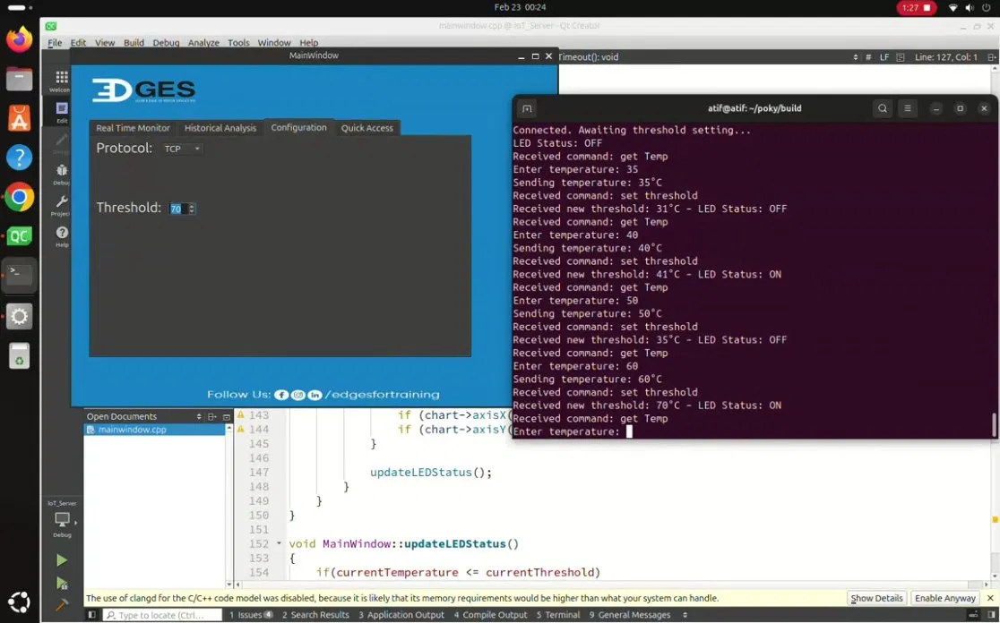

<div align="center">

# 🌡️ IoT Device Communication System


**A full IoT device communication system — Qt6 GUI server on laptop ↔ C++ terminal client on QEMU**

*Built as part of the Embedded Linux Diploma @ Edges Academy*

---



</div>

---

## 📌 Table of Contents

- [Overview](#-overview)
- [Repository Structure](#-repository-structure)
- [OOP Design](#-oop-design)
- [Client Application](#-client-application)
- [IoT Server Application](#-iot-server-application)
- [Communication Protocol](#-communication-protocol)
- [Technologies](#-technologies)
- [Demo](#-demo)

---

## 🔍 Overview

The system simulates a real-world IoT scenario where a **QEMU-emulated client** acts as a sensor device and communicates with a **Qt6 GUI server** running on a laptop over TCP or UDP sockets — both implemented in C++ with full OOP principles.

```
┌─────────────────────────┐         TCP / UDP          ┌──────────────────────────────┐
│   IoT Server (Laptop)   │  ◄────────────────────►   │   Client (QEMU Terminal)     │
│   Qt6 GUI Dashboard     │     Port 5000 · 1 sec      │   Yocto Linux Image          │
│                         │                            │                              │
│  • Real Time Monitor    │   ──── get Temp ────►      │  • Prompts user for temp     │
│  • Historical Graph     │   ◄─── temperature ──      │  • Sends reading to server   │
│  • Threshold Config     │   ── set threshold ──►     │  • Updates LED status        │
│  • LED Status Display   │                            │  • Displays ON / OFF         │
└─────────────────────────┘                            └──────────────────────────────┘
```

### How it works

Every **1 second**, the server checks if the temperature threshold changed:

| Condition | Server sends | Client action |
|---|---|---|
| Threshold **changed** | `set threshold` + new value | Receives value → updates LED status display |
| Threshold **unchanged** | `get Temp` | Prompts user → sends temperature to server |

---

## 📁 Repository Structure

```
IoT-Communication-System/
│
├── 📂 client/                    # Terminal client (QEMU)
│   ├── 📂 include/
│   │   ├── Socket.h              # Abstract socket interface
│   │   ├── TCPSocket.h
│   │   ├── UDPSocket.h
│   │   ├── Channel.h             # Abstract channel interface
│   │   └── ClientChannel.h
│   ├── 📂 src/
│   │   ├── main.cpp              # Entry point — protocol selection
│   │   ├── TCPSocket.cpp
│   │   ├── UDPSocket.cpp
│   │   └── ClientChannel.cpp     # Command handler logic
│   └── Makefile
│
├── 📂 IoT_Server/                # Qt6 GUI server (laptop)
│   ├── Socket.h / Channel.h
│   ├── TCPSocket.h/.cpp
│   ├── UDPSocket.h/.cpp
│   ├── ServerChannel.h/.cpp
│   ├── mainwindow.h/.cpp/.ui
│   ├── main.cpp
│   ├── resources.qrc
│   ├── CMakeLists.txt
│   └── Makefile
│
├── 📂 meta-iotclient/            # Custom Yocto layer for client
│
└── 📄 README.md
```

---

## 🧱 OOP Design

The project enforces **Abstraction · Encapsulation · Inheritance · Polymorphism** through a shared class hierarchy used in both the client and server:

```
                    ┌──────────────┐
                    │   Socket     │  ← Abstract base class
                    │  (pure virt) │    connect / send / receive / shutdown
                    └──────┬───────┘
                           │
              ┌────────────┴────────────┐
              │                         │
        ┌─────▼──────┐          ┌───────▼──────┐
        │  TCPSocket │          │  UDPSocket   │
        │ SOCK_STREAM│          │ SOCK_DGRAM   │
        │            │          │ (1s timeout) │
        └────────────┘          └──────────────┘

                    ┌──────────────┐
                    │   Channel    │  ← Abstract base class
                    │  Socket* ───►│    start / stop / send / receive
                    └──────┬───────┘
                           │
              ┌────────────┴────────────┐
              │                         │
       ┌──────▼───────┐        ┌────────▼──────┐
       │ ClientChannel│        │ ServerChannel │
       │ handleCommand│        │ dispatchCmd   │
       └──────────────┘        └───────────────┘
```

> Protocol (TCP or UDP) is selected at **runtime** — the rest of the system operates transparently through the abstract `Socket*` pointer.

---

## 💻 Client Application

### Build (Native Linux)

```bash
cd client
make
```

Produces `client_app.exe` via:
```
g++ -std=c++17 -pthread -Iinclude src/*.cpp -o client_app.exe
```

### Run

```bash
./client_app.exe [server_ip]        # defaults to 192.168.7.1 (QEMU TAP bridge)
```
```
Select Protocol (TCP/UDP): TCP
```

### Run on QEMU (Yocto)

```bash
# 1. Build Yocto image with meta-iotclient layer included
# 2. Launch QEMU
runqemu qemux86-64 nographic

# 3. Inside QEMU terminal
./client_app.exe <host_ip>
```

### Sample Output

```
Attempting to connect to server...
Connected. Awaiting threshold setting...
LED Status: OFF
Received command: set threshold
Received new threshold: 31°C – LED Status: OFF
Received command: get Temp
Enter temperature: 35
Sending temperature: 35°C
Received command: set threshold
Received new threshold: 41°C – LED Status: ON
Received command: get Temp
Enter temperature: 50
Sending temperature: 50°C
```

---

## 🖥️ IoT Server Application (Qt6 GUI)

### GUI Tabs

| Tab | Description |
|---|---|
| 📊 **Real Time Monitor** | Live temperature meter updated every second |
| 📈 **Historical Analysis** | 2D graph of all temperature readings over time |
| ⚙️ **Configuration** | Set and calibrate the temperature threshold |
| 🔗 **Quick Access** | Buttons to open Facebook, LinkedIn, Instagram |

The GUI also shows a live **LED Status (ON/OFF)** indicator based on the latest threshold vs. received temperature.

### Build

```bash
# CMake
cd IoT_Server
mkdir build && cd build
cmake ..
make
./IoT_Server

# Or with Makefile directly
cd IoT_Server
make
```

### Prerequisites

- Qt6 (`Qt6::Widgets` + `Qt6::Charts`)
- CMake ≥ 3.16
- GCC/G++ with C++17

---

## 📡 Communication Protocol

| Property | Value |
|---|---|
| Port | `5000` |
| Interval | Every `1 second` |
| Protocols | TCP · UDP |
| Default server IP (QEMU) | `192.168.7.1` |

---

## 🛠️ Technologies

| Technology | Role |
|---|---|
| C++17 | Core language for both client and server |
| Qt6 (Widgets + Charts) | Server GUI |
| POSIX TCP/UDP Sockets | Network communication |
| Yocto Project | Custom Linux image with `meta-iotclient` layer |
| QEMU | Client emulation environment |
| CMake + Makefile | Build automation |

---

## 🎥 Demo

<div align="center">

📹 **Full demo video** available in the project's Google Drive folder.

</div>

---

<div align="center">

*Embedded Linux Diploma · Edges Academy*

</div>
